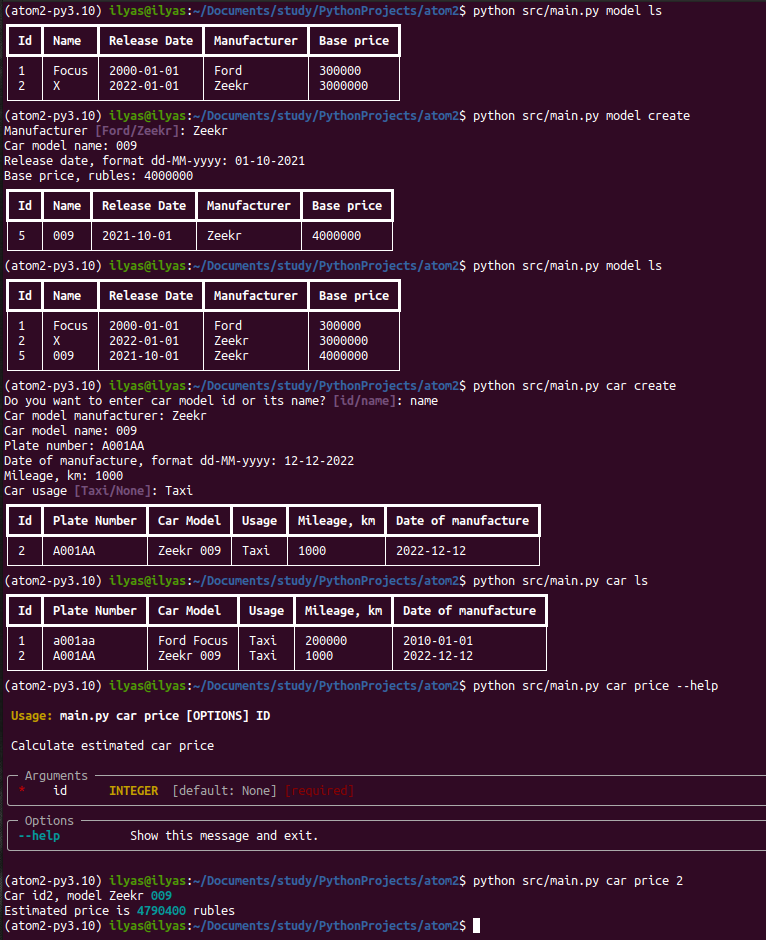

# Fleet Management System

## ATOM, Practice

## Installment

1. Проект написан на Python с использованием Poetry, 
поэтому для начала нужно установить его и войти
в виртуальное окружение
```
pip install --upgrade pip

pip install poetry

poetry shell

poetry install
```
2. Разбираемся с переменными среды. Скопируйте файл ``.env.dist``,
переименуйте его в ``.env``, поменяйте нужные настройки
3. Поднять базу данных можно через докер:
```
docker compose up -d
```
4. Инициализация базы данных:
```
python src/main.py init_db
```
5. Можно использовать приложение!
```
python src/main.py manufacturer ls

...

python src/main.py car find A100AA

...

python src/main.py model --help
...
```
## Usage

Мной реализовано несколько сервисов по работе с автоиобилями
(Fleet Management System). Доступ к ним предоставляется через
CLI, в любой момент можно вызывать пояснения к той или иной команде
или блоку команд

### Пример использования:


## Оффтопик

Изначально я планировал писать приложение на Джанго, поскольку подумал,
что пункт про создание консольного приложения создан исключительно для
нашего удобства, чтобы облегчить разработку. В итоге всё же передумал,
изучил новые для себя технологии, намучился очень. Если бы я писал на Джанго,
процесс шел бы в несколько раз быстрее. 

Проект пока сыроват, надеюсь успеть доделать его в срок. 
Был бы очень рад обратной связи, хотя понимаю, что и сам виноват - 
долго ничего не показывал. Есть много вопросов как минимум по поводу архитектуры,
адекватной степени абстракций (я даже попытался от фреймворков не зависеть
в какой-то степени), а главное - по поводу DI.

Проект ещё живой и набирается сил!

P.S. Хочу и доп закончить, зря что ли изучал все эти технологии
